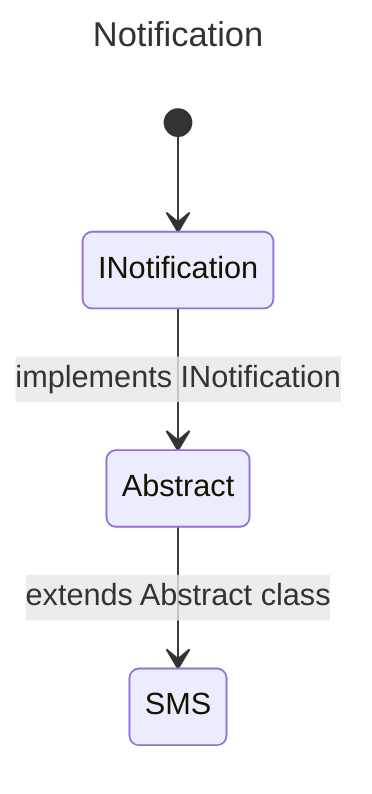

# 13. Polymorphism & Dependency Injection

Before we delve deeper into the two concepts mentioned above, it is necessary to set the groundwork. We will cover in a few points what interfaces, abstract classes (including abstract methods) are, before concluding with an explanation of what polymorphism is and finishing with dependency injection.

## 1. Interfaces
Imagine you are working on a project that implements a notification system. Today, your system can notify a client via email.

So you begin your feature. Being a beginner in development, you create a class? That's a good thing. Here is a small implementation of the feature.

```csharp
public class Email 
{
    public void SendEmail(string message) 
    {
        // Implementing the feature
    }
}
```

Imagine, our classes have multiple methods, because here, for example, this class is very simple. Suppose your project manager asks you to implement a new notification method via SMS. How would you implement it? Its methods?

You would then open the *Email* class, observe what you have already developed, and try to reproduce what is already existing while adapting it to this new feature.

This is where "interfaces" and abstract classes come into play. Let's focus on interfaces for the moment.

>In object-oriented programming, an interface is a set of public method signatures of an object.

It's somewhat a contract that classes must adhere to if it is implemented. It may contain:
-cProperties
-cMethods (public)

```csharp
public interface INotification
{
    public void Send();
}

public class Email: INotification
{
    public void Send()
    {
        // 
    }
}

public class SMS : INotification
{
    public void Send()
    {
        // 
    }
}
```

VPlease note that interfaces in .NET, for convention's sake, must start with a capital *I*. Which sort of allows implementing the methods or properties of the interface in the class.

If these methods are not implemented in the class, you will get an error during the build.

You see, it's simple, right?

## 2. Abstract Classes
Well now, let me introduce you to several important scenarios.

1. Shared methods are identical, should I "rewrite" this same method in every class that implements this interface?
2. I have three classes that share the same interface, two of them have an identical method, however, in the third class, it's completely different, what to do?

The answer is simply abstract classes.

> In object-oriented programming (OOP), an abstract class is a class if and only if it is not instantiable. It serves as a base for other derived (inherited) classes.

From there, we can understand that it is a class that:
- is not instantiable,
- serves as a base for other classes.

This perfectly addresses our issue.



```csharp
public interface INotification
{
    void Send(string message);
}

public abstract class Notification : INotification
{
    public abstract void Send(string message);

    public void Acknowledge()
    {
        // Common code to acknowledge receipt
    }
}

public class Email : Notification
{
    public override void Send(string message)
    {
        // Send an email with the message
    }
}

public class SMS : Notification
{
    public override void Send(string message)
    {
        // Send an SMS with the message
    }
}
```

In this example, you have three cases:

- `public abstract void Send()`: Abstract methods must be defined in an abstract class without containing an implementation body. They must be mandatorily implemented in the derived classes, each providing their own implementation. 
- `public void Acknowledge()`: A non-abstract method can be implemented to provide base code, which can be used as is or overridden in a derived class to adapt or modify its behavior.
- `public virtual void Send()`: This method can have an implementation body and must be accompanied by an override in a method of the derived class if it is overridden. This allows extending or modifying the method according to the specific needs of the derived classes.

## Polymorphism 
> In computer science and type theory, polymorphism, from the ancient Greek polús (many) and morphê (form), is the concept of providing a single interface to entities that can have different types.

```csharp

public interface IForm
{
    float Aire(); // If the method is public, not mandatory to write it.
}

public abstract class Form : IForm
{
    public abstract float Aire();
}

public class Square : Form
{
    public float side { get; set; }

    public override float Aire()
    {
        return (float) Math.Pow(side, 2);
    }
}

public class Circle : Form
{
    public float radius {get; set;}

    public override float Aire()
    {
        return (float) (Math.PI * Math.Pow(radius, 2));
    }
}
```

Now let's try to understand how we instantiate our two classes.

Usually, we proceed this way:

```csharp
Square square = new {side = 12.3f};
Circle circle = new {radius = 23.2f};
```

But with polymorphism, the interface can become the type.

```csharp
Form square = new Square {side = 12.3f};
Form circle = new Circle {radius = 23.2f};  
```

You might ask: OK, but what use is that to me? I understand your frustration, that's why we need to move on to the section on "dependency injection".

[See more about Polymorphism](https://learn.microsoft.com/en-us/dotnet/csharp/fundamentals/object-oriented/polymorphism)

## Dependency Injection


## Exercices

