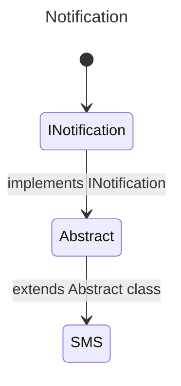

# 13. Polymorphism & Dependency Injection

Before we delve deeper into the two concepts mentioned above, it is necessary to set the groundwork. We will cover in a few points what interfaces, abstract classes (including abstract methods) are, before concluding with an explanation of what polymorphism is and finishing with dependency injection.

## 1. Interfaces
Imagine you are working on a project that implements a notification system. Today, your system can notify a client via email.

So you begin your feature. Being a beginner in development, you create a class? That's a good thing. Here is a small implementation of the feature.

```csharp
public class Email 
{
    public void SendEmail(string message) 
    {
        // Implementing the feature
    }
}
```

Imagine, our classes have multiple methods, because here, for example, this class is very simple. Suppose your project manager asks you to implement a new notification method via SMS. How would you implement it? Its methods?

You would then open the *Email* class, observe what you have already developed, and try to reproduce what is already existing while adapting it to this new feature.

This is where "interfaces" and abstract classes come into play. Let's focus on interfaces for the moment.

>In object-oriented programming, an interface is a set of public method signatures of an object.

It's somewhat a contract that classes must adhere to if it is implemented. It may contain:
-cProperties
-cMethods (public)

```csharp
public interface INotification
{
    public void Send();
}

public class Email: INotification
{
    public void Send()
    {
        // 
    }
}

public class SMS : INotification
{
    public void Send()
    {
        // 
    }
}
```

VPlease note that interfaces in .NET, for convention's sake, must start with a capital *I*. Which sort of allows implementing the methods or properties of the interface in the class.

If these methods are not implemented in the class, you will get an error during the build.

You see, it's simple, right?

## 2. Abstract Classes
Well now, let me introduce you to several important scenarios.

1. Shared methods are identical, should I "rewrite" this same method in every class that implements this interface?
2. I have three classes that share the same interface, two of them have an identical method, however, in the third class, it's completely different, what to do?

The answer is simply abstract classes.

> In object-oriented programming (OOP), an abstract class is a class if and only if it is not instantiable. It serves as a base for other derived (inherited) classes.

From there, we can understand that it is a class that:
- is not instantiable,
- serves as a base for other classes.

This perfectly addresses our issue.



```csharp
public interface INotification
{
    void Send(string message);
}

public abstract class Notification : INotification
{
    public abstract void Send(string message);

    public void Acknowledge()
    {
        // Common code to acknowledge receipt
    }
}

public class Email : Notification
{
    public override void Send(string message)
    {
        // Send an email with the message
    }
}

public class SMS : Notification
{
    public override void Send(string message)
    {
        // Send an SMS with the message
    }
}
```

In this example, you have three cases:

- `public abstract void Send()`: Abstract methods must be defined in an abstract class without containing an implementation body. They must be mandatorily implemented in the derived classes, each providing their own implementation. 
- `public void Acknowledge()`: A non-abstract method can be implemented to provide base code, which can be used as is or overridden in a derived class to adapt or modify its behavior.
- `public virtual void Send()`: This method can have an implementation body and must be accompanied by an override in a method of the derived class if it is overridden. This allows extending or modifying the method according to the specific needs of the derived classes.

## Polymorphism 
> In computer science and type theory, polymorphism, from the ancient Greek polús (many) and morphê (form), is the concept of providing a single interface to entities that can have different types.

```csharp

public interface IForm
{
    float Aire(); // If the method is public, not mandatory to write it.
}

public abstract class Form : IForm
{
    public abstract float Aire();
}

public class Square : Form
{
    public float side { get; set; }

    public override float Aire()
    {
        return (float) Math.Pow(side, 2);
    }
}

public class Circle : Form
{
    public float radius {get; set;}

    public override float Aire()
    {
        return (float) (Math.PI * Math.Pow(radius, 2));
    }
}
```

Now let's try to understand how we instantiate our two classes.

Usually, we proceed this way:

```csharp
Square square = new {side = 12.3f};
Circle circle = new {radius = 23.2f};
```

But with polymorphism, the interface can become the type.

```csharp
Form square = new Square {side = 12.3f};
Form circle = new Circle {radius = 23.2f};  
```

You might ask: OK, but what use is that to me? I understand your frustration, that's why we need to move on to the section on "dependency injection".

[See more about Polymorphism](https://learn.microsoft.com/en-us/dotnet/csharp/fundamentals/object-oriented/polymorphism)

## Dependency Injection

> Dependency injection facilitates the management of dependencies between components by delegating them to an external manager (often called a "dependency injection container"), which handles the creation and binding of necessary dependencies without the components having to manage these details themselves.

Dependency injection is an important concept in object-oriented programming.

This concept allows for the division of classes into services and for associating them without making them dependent on one another.

Consider a case where a user can receive notifications about a bill. It is preferable to proceed as follows:

- A User service
- A Notification service

And to create a dependency injection in the user class.

The reason for doing this is that, suppose your project manager asks you that when a product is available on your e-commerce site, it should also be possible to send notifications to users.

We then have a service that is called in two different places. This notification service does not depend on any specific class. It is simply implemented in a class that requires this service.

This allows work on the notification service independently of the classes calling this service.

### Example
Now let's move on to an example, which I hope will help you understand.

### 1. Define an Interface
First, we define an interface that specifies the methods the dependent implementation must provide. For example, an IService interface that has an Execute method.

```csharp
public interface IService
{
    void Execute();
}
```

### 2. Create an Implementation of the Interface
Next, we create a concrete class that implements this interface. This class will perform the specific functionality.

```csharp
public class MyService : IService
{
    public void Execute()
    {
        Console.WriteLine("Service is executed.");
    }
}
```

### 3. Use Dependency Injection in a Consumer Class
Now, we create a class that consumes IService. This class does not create an instance of MyService directly but receives an instance through its constructor. This is called "dependency injection."

```csharp
public class Consumer
{
    private IService _service;

    public Consumer(IService service)
    {
        _service = service;
    }

    public void RunService()
    {
        _service.Execute();
    }
}
```

## Exercices
### 1. Abstract Classes and Polymorphism
Create an abstract class `Vehicle` with an abstract method `Start()`. Define two subclasses, `Car` and `Motorcycle`, which implement the `Start()` method. Each subclass should have a different message when starting. Test polymorphism by creating a list of Vehicle objects and starting each `vehicle` in the loop.

### 2. Interface and Polymorphism
Define an interface `Animal` with a method `MakeNoise()`. Implement this interface in the classes `Dog` and `Cat`, where `MakeNoise()` will display "Barks" for the Dog and "Meows" for the Cat. Create a list of `Animal` and iterate through it to call `MakeNoise()` on each animal, demonstrating polymorphism.

### 3. Abstract Class and Interface
Create an abstract class `Shape` with an abstract method `CalculateArea()`. Create an interface Paintable with a method `Paint(color)`. Implement both in the classes `Circle` and `Square` where `CalculateArea()` computes the area of the shape and `Paint(color)` displays a message indicating that the shape has been painted with the specified color.

### 4. Dependency Injection
Create a class `Engine` with a method `Function()`. Create a class `Car` that requires an `Engine` object in its constructor. Use dependency injection to pass a specific engine to a `Car` object upon creation. Test multiple types of engines (for example, `GasolineEngine`, `DieselEngine`) that can be injected into the Car.

### 5. Interface, Polymorphism, and Dependency Injection

Define an interface `Storage` with a method `Save(data)`. Create two classes that implement this interface: `DiskStorage` and `CloudStorage`. In an Application class, use dependency injection to pass a specific `Storage` implementation to use. Test the application with different storage methods, demonstrating polymorphism in the use of storage strategies.


---


